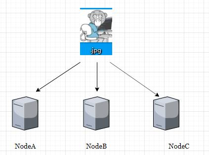
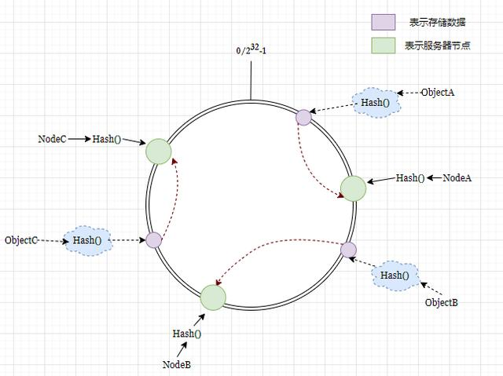
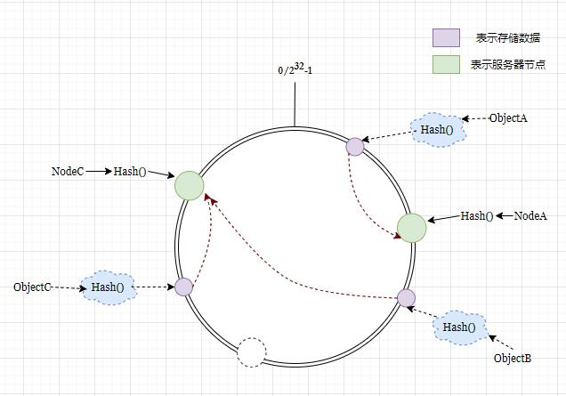
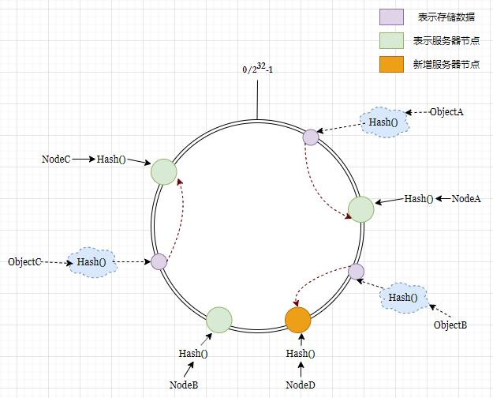
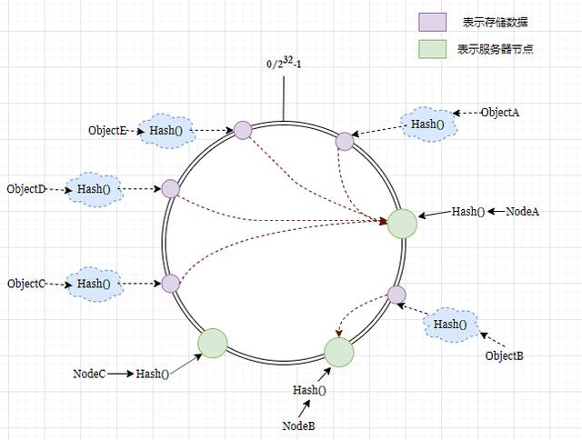
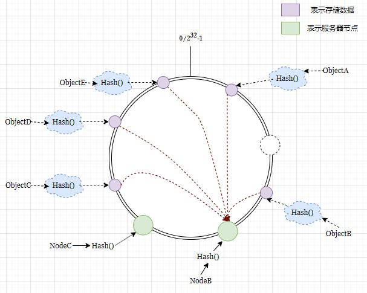
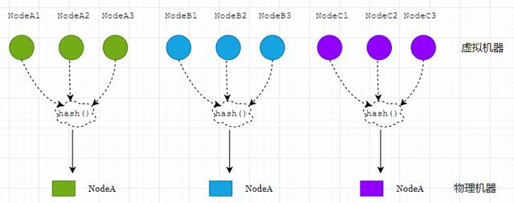
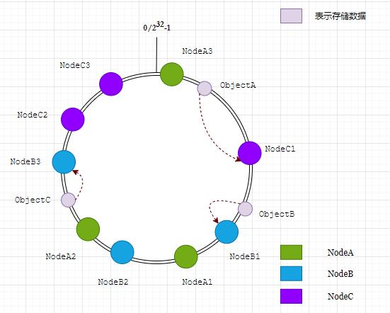

概述
一致Hash在分布式应用中,是常见的负载均衡方式,多用于资源请求映射分散到具体某一台节点服务器,使得每一台服务器能固定处理部分请求,同时,能较小的减少由于动态增减服务器节点带来请求的失效，保证系统更好对外提供服务。

从问题的发展引入思考

图1.假设现在有200万张图片资源，需要随机的分配到3台服务器
除余法
很多人一下子就想到了除余法,通过给每个图片唯一编号(较少的情况),或者通过hash文件名(假设文件名不重复)得到唯一的数字串,然后除余就能随机存放到服务器。
hash(文件名) % n
正常情况下这个算法已经基本满足,因为每次除余之后必然会得到0,1,2三个数,分别对应三台服务器,下次需要找回这些图片资源只要按同样的方式hash之后就能在对应服务器找到。
但是当图片资源过多无法满足需要增加一台服务器的时候,因为除数的改变,带来余数的改变,也就是服务器数量的改变,带来存储位置的改变,之前存储的图片资源失去了意义,在缓存服务器中,这会导致大量缓存失效,造成缓存的雪崩,为了解决这些问题,一致性hash应运而生。

揭开一致性Hash神秘面纱
首先了解一下计算一致性hash时采用的方式和步骤：
在一个0~2^32区间的圆环上，计算服务器节点的hash值,。
用同样的方式计算存储数据的hash,并映射到相同的圆上。
然后从数据映射到的位置开始顺时针查找，那么在圆上必然能映射到具体一台节点服务器。

图2.一致hash算法映射到圆环
这里解释一下,一致性Hash也是采用取模的方法,其hash计算的区间同样是在0~2^32,这算法很多语言都有,比如go语言的crc32.ChecksumIEEE就有实现此算法,那么这个一致性hash有什么优势呢?

图3.NodeB宕机/摘除的情况(虚线圆)

图4.新增一个节点的情况
如图3.在NodeB宕机或摘除节点之后,存储数据对象ObjectB按照顺时针原则重新映射到NodeC服务器节点。
如图4.在新增节点NodeD之后，存储数据对象ObjectB同样映射到了NodeD服务器节点，但是新增和摘除节点都没有影响到ObjectA和ObjectC,这就使得这种一致hash算法在增减节点时候并不会导致大面积请求资源的失效。
并且随着服务器节点的增加，影响会越来越小。但是理想很丰满,现实却很骨感,当服务节点比较少的情况下,其实并不是如图3,图4这样分配均匀的，而是有可能出现数据倾斜的,下面拿摘除NodeA做举例：

图5.一致hash可能出现数据倾斜的情况

图6.NodeA宕机/摘除,大量存储数据映射到了NodeB
如图5、6不难看出，当服务器较少并且数据出现一定倾斜的时候,假设NodeA出现宕机,这时候资源请求会重新映射到NodeB,那么NodeB机器的压力就会暴涨,在硬件资源有限的情况下,又怎么更好的处理这个问题呢？

虚拟节点
上面提到的过程基本上就是一致性hash的基本原理了,不过还有一个问题就是当服务器节点较少的时候,如何解决这个负载不均衡的问题，那就是虚拟节点。
其实就是将每台物理机器,映射成n多个虚拟机器,再将这些虚拟机器hash之后映射到圆环上。

图7.虚拟机器和物理机器的映射

图8.生成多个虚拟节点进行映射，图中省略了hash过程

数据定位到圆环算法是不变的，只是多了一步虚拟节点到实际节点的映射。
你品,你细品一下!!

最后,表述一下在动态变化的Cache环境中，判定哈希算法好坏的四个定义：
1、平衡性(Balance)：平衡性是指哈希的结果能够尽可能分布到所有的缓冲中去，这样可以使得所有的缓冲空间都得到利用。很多哈希算法都能够满足这一条件。
2、单调性(Monotonicity)：单调性是指如果已经有一些内容通过哈希分派到了相应的缓冲中，又有新的缓冲加入到系统中。哈希的结果应能够保证原有已分配的内容可以被映射到原有的或者新的缓冲中去，而不会被映射到旧的缓冲集合中的其他缓冲区。
3、分散性(Spread)：在分布式环境中，终端有可能看不到所有的缓冲，而是只能看到其中的一部分。当终端希望通过哈希过程将内容映射到缓冲上时，由于不同终端所见的缓冲范围有可能不同，从而导致哈希的结果不一致，最终的结果是相同的内容被不同的终端映射到不同的缓冲区中。这种情况显然是应该避免的，因为它导致相同内容被存储到不同缓冲中去，降低了系统存储的效率。分散性的定义就是上述情况发生的严重程度。好的哈希算法应能够尽量避免不一致的情况发生，也就是尽量降低分散性。
4、负载(Load)：负载问题实际上是从另一个角度看待分散性问题。既然不同的终端可能将相同的内容映射到不同的缓冲区中，那么对于一个特定的缓冲区而言，也可能被不同的用户映射为不同 的内容。与分散性一样，这种情况也是应当避免的，因此好的哈希算法应能够尽量降低缓冲的负荷。
4、平滑性(Smoothness)：平滑性是指缓存服务器的数目平滑改变和缓存对象的平滑改变是一致的。

下节课将给童鞋们讲解一下一致hash算法的代码实现,喜欢童鞋可以关注一哈
